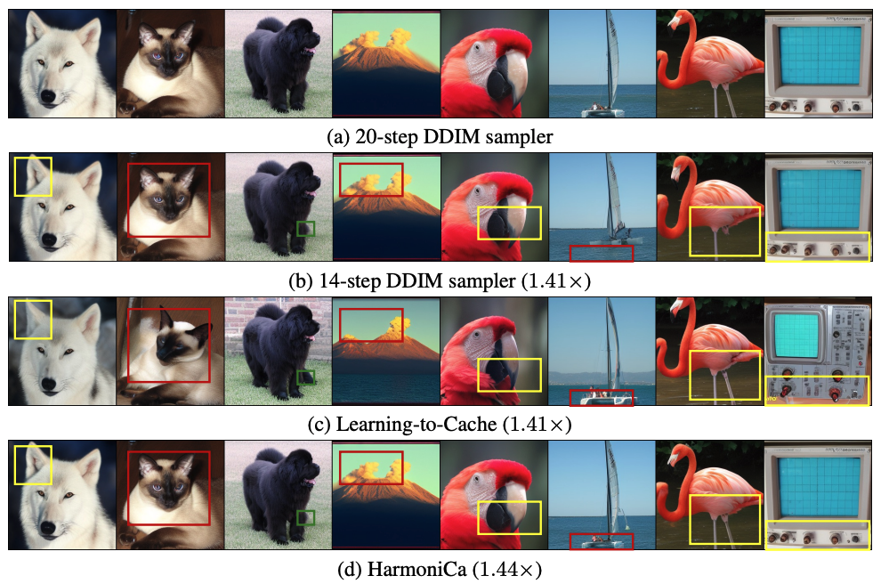
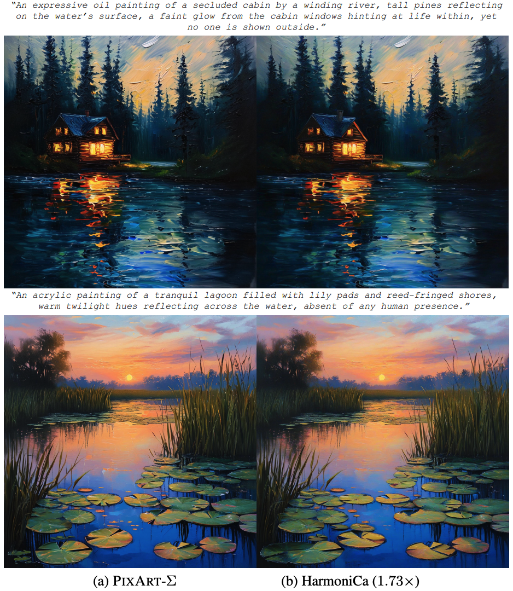

<div align="center" style="font-family: charter;">
<h1> 🎵 HarmoniCa: Harmonizing Training and Inference for Better Feature Caching in Diffusion Transformer Acceleration</h1>

[](https://opensource.org/licenses/Apache-2.0)&nbsp;
[](https://arxiv.org/pdf/2410.01723)&nbsp;
[](https://github.com/ModelTC/HarmoniCa)&nbsp;

**[ [Conference Paper](https://arxiv.org/abs/2410.01723) | [Slides](assets/slides.pdf) | [Poster](assets/poster.pdf) ]**

[Yushi Huang*](https://github.com/Harahan), [Zining Wang*](https://scholar.google.com/citations?user=hOXoacgAAAAJ&hl=en), [Ruihao Gong📧](https://xhplus.github.io/), [Jing Liu](https://jing-liu.com/), [Xinjie Zhang](https://xinjie-q.github.io/), [Jinyang Guo](https://jinyangguo.github.io/), [Xianglong Liu](https://xlliu-beihang.github.io/), [Jun Zhang📧](https://eejzhang.people.ust.hk/)

(* denotes equal contribution, 📧 denotes corresponding author.)

</div>

This is the official implementation of our paper [HarmoniCa](https://arxiv.org/pdf/2410.01723), a novel training-based framework that achieves a new state-of-the-art result in block-wise caching of diffusion transformers. It achieves over 40% latency reduction (*i.e.*, $2.07\times$ theoretical speedup) and improved performance on PixArt- $\alpha$. Remarkably, our *image-free* approach reduces training time by 25\% compared with the previous method.

<div align=center>
	<figure class="second">
	    
	</figure>
	
<h align="justify">(Left) Generation comparison on DiT-XL/2 $256\times256$. (Right) Generation results on PixArt-$\Sigma$ $2048\times2048$. HarmoniCa shows nearly lossless $1.44\times$ and $1.73\times$ acceleration for the above models, respectively. 
</h>
</div>

## :fire: News

* **May 03, 2025**: 🔥 We release our Python code for DiT-XL/2 presented in our paper. Have a try!

* **May 01, 2025**: 🌟 Our paper has been accepted by ICML 2025! 🎉 Cheers!


## 📖 Overview

<div align="center" style="font-family: charter;">


<h align="justify"><strong>Overview pipeline of the proposed HarmoniCa.</strong> It first incorporates Step-Wise Denoising Training (SDT) to ensure the continuity of the denoising process, where prior steps can be leveraged. In addition, an Image Error Proxy-Guided Objective (IEPO) is applied to balance image quality against cache utilization through an efficient proxy to approximate the image error.
</h>

</div>    

## ✨ Quick Start

After cloning the repository, you can follow these steps to complete the model's training and inference process.

### Requirements

With PyTorch (>2.0) installed, execute the following command to install the  necessary packages and pre-trained models.

```bash
pip install accelerate diffusers timm torchvision wandb
python download.py
```

### Training

We'd like to provide the following example to train the model. More details about the training can be found in our paper.

```bash
export CUDA_VISIBLE_DEVICES=0,1,2,3
torchrun --nnodes=1 --nproc_per_node=4 --master_port 12345 train_router.py --results-dir results --model DiT-XL/2 --image-size 256 --num-classes 1000 --epochs 2000 --global-batch-size 64 --global-seed 42 --vae ema --num-works 8 --log-every 100 --ckpt-every 1000 --wandb --num-sampling-steps 10 --l1 7e-8 --lr 0.01 --max-steps 20000 --cfg-scale 1.5 --ste-threshold 0.1 --lambda-c 500
```

### Inference

Here is the corresponding command for inference.

```bash
python sample.py --model DiT-XL/2 --vae ema --image-size 256 --num-classes 1000 --cfg-scale 4 --num-sampling-steps 10 --seed 42 --accelerate-method dynamiclayer --ddim-sample --path Path/To/The/Trained/Router/ --thres 0.1
```

## 💪 TODO

- [ ] Training and inference code for PixArt models.
- [ ] Combination with quantization.

## 🤝 Acknowledgments

Our code was developed based on [DiT](https://github.com/facebookresearch/DiT) and [Learning-to-Cache](https://github.com/horseee/learning-to-cache).

## ✏️ Citation

If you find our HarmoniCa useful or relevant to your research, please kindly cite our paper:

```
@inproceedings{
    anonymous2025harmonica,
    title={HarmoniCa: Harmonizing Training and Inference for Better Feature Caching in Diffusion Transformer Acceleration},
    author={Yushi Huang and Zining Wang and Ruihao Gong and Jing Liu and Xinjie Zhang and Jinyang Guo and Xianglong Liu and Jun Zhang},
    booktitle={Forty-second International Conference on Machine Learning},
    year={2025},
}
```
